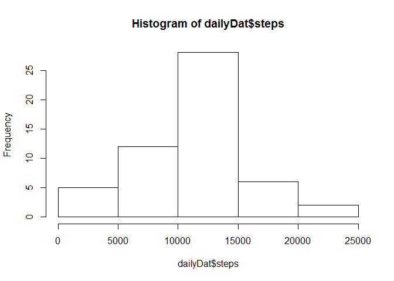

## Loading and preprocessing the data
Load the raw data

```r
rawDat <- read.csv("activity.csv", header=TRUE, sep=",", stringsAsFactors = FALSE)
str(rawDat)
```

```
## 'data.frame':	17568 obs. of  3 variables:
##  $ steps   : int  NA NA NA NA NA NA NA NA NA NA ...
##  $ date    : chr  "2012-10-01" "2012-10-01" "2012-10-01" "2012-10-01" ...
##  $ interval: int  0 5 10 15 20 25 30 35 40 45 ...
```
Let us convert the date column from character to date data type

```r
rawDat$date <- as.Date(rawDat$date)
summary(rawDat)
```

```
##      steps             date               interval     
##  Min.   :  0.00   Min.   :2012-10-01   Min.   :   0.0  
##  1st Qu.:  0.00   1st Qu.:2012-10-16   1st Qu.: 588.8  
##  Median :  0.00   Median :2012-10-31   Median :1177.5  
##  Mean   : 37.38   Mean   :2012-10-31   Mean   :1177.5  
##  3rd Qu.: 12.00   3rd Qu.:2012-11-15   3rd Qu.:1766.2  
##  Max.   :806.00   Max.   :2012-11-30   Max.   :2355.0  
##  NA's   :2304
```
Let us remove the rows with missing values for steps

```r
dat <- rawDat[!is.na(rawDat$steps), ]
str(dat)
```

```
## 'data.frame':	15264 obs. of  3 variables:
##  $ steps   : int  0 0 0 0 0 0 0 0 0 0 ...
##  $ date    : Date, format: "2012-10-02" "2012-10-02" ...
##  $ interval: int  0 5 10 15 20 25 30 35 40 45 ...
```
## What is mean total number of steps taken per day?
Daily total of the steps

```r
dailyDat <- with(dat, aggregate(list(steps = dat$steps), by=list(date = dat$date), FUN=sum))
summary(dailyDat)
```

```
##       date                steps      
##  Min.   :2012-10-02   Min.   :   41  
##  1st Qu.:2012-10-16   1st Qu.: 8841  
##  Median :2012-10-29   Median :10765  
##  Mean   :2012-10-30   Mean   :10766  
##  3rd Qu.:2012-11-16   3rd Qu.:13294  
##  Max.   :2012-11-29   Max.   :21194
```
Mean number of daily steps = 10766  
Median number of daily steps = 10765  

Histogram of the total number of steps taken each day

```r
hist(dailyDat$steps)
```

<!-- -->
## What is the average daily activity pattern?
Average number of steps taken for each time slot, averaged across all days

```r
timeslotAvg = with(dat, aggregate(list(steps = steps), by = list(interval = interval), FUN = mean))
```
A time series plot (i.e. ) of the 5-minute interval (x-axis) and the average number of steps taken, averaged across all days (y-axis)

```r
with(timeslotAvg, plot(interval, steps, type= "l"))
```

<!-- -->
5-minute interval, on average across all the days in the dataset, that contains the maximum number of steps

```r
str(timeslotAvg)
```

```
## 'data.frame':	288 obs. of  2 variables:
##  $ interval: int  0 5 10 15 20 25 30 35 40 45 ...
##  $ steps   : num  1.717 0.3396 0.1321 0.1509 0.0755 ...
```

```r
timeslotAvg[timeslotAvg$steps == max(timeslotAvg$steps), ]
```

```
##     interval    steps
## 104      835 206.1698
```
As seen above, interval 835 has the maximum number of steps averaged across all the days

## Imputing missing values
Calculate and report the total number of missing values in the dataset (i.e. the total number of rows with s)  

As seen from the summary of the raw data at the beginning, there are 2304 missing valus for steps.  

Devise a strategy for filling in all of the missing values in the dataset. The strategy does not need to be sophisticated. For example, you could use the mean/median for that day, or the mean for that 5-minute interval, etc.
Create a new dataset that is equal to the original dataset but with the missing data filled in.


```r
filledDat <- rawDat

for(indx in 1: nrow(filledDat)) {
    if (is.na(filledDat[indx, ]$step)) {
        filledDat[indx, ]$steps <- timeslotAvg[timeslotAvg$interval == filledDat[indx, ]$interval, ]$steps
    }
}
summary(filledDat)
```

```
##      steps             date               interval     
##  Min.   :  0.00   Min.   :2012-10-01   Min.   :   0.0  
##  1st Qu.:  0.00   1st Qu.:2012-10-16   1st Qu.: 588.8  
##  Median :  0.00   Median :2012-10-31   Median :1177.5  
##  Mean   : 37.38   Mean   :2012-10-31   Mean   :1177.5  
##  3rd Qu.: 27.00   3rd Qu.:2012-11-15   3rd Qu.:1766.2  
##  Max.   :806.00   Max.   :2012-11-30   Max.   :2355.0
```

```r
str(filledDat)
```

```
## 'data.frame':	17568 obs. of  3 variables:
##  $ steps   : num  1.717 0.3396 0.1321 0.1509 0.0755 ...
##  $ date    : Date, format: "2012-10-01" "2012-10-01" ...
##  $ interval: int  0 5 10 15 20 25 30 35 40 45 ...
```
As seen above, the new data frame with artificially filled in missing values, do not have any NA in "steps" any more.  

Make a histogram of the total number of steps taken each day and Calculate and report the mean and median total number of steps taken per day.

```r
filledDailyDat <- with(filledDat, aggregate(list(steps = filledDat$steps), by=list(date = filledDat$date), FUN=sum))
summary(filledDailyDat)
```

```
##       date                steps      
##  Min.   :2012-10-01   Min.   :   41  
##  1st Qu.:2012-10-16   1st Qu.: 9819  
##  Median :2012-10-31   Median :10766  
##  Mean   :2012-10-31   Mean   :10766  
##  3rd Qu.:2012-11-15   3rd Qu.:12811  
##  Max.   :2012-11-30   Max.   :21194
```
Do these values differ from the estimates from the first part of the assignment? What is the impact of imputing missing data on the estimates of the total daily number of steps?

Is seen from the original data and the filled in data, the impact on the mean, median etc. are negligible.

## Are there differences in activity patterns between weekdays and weekends?

```r
filledDat$day <- weekdays(filledDat$date)
for (indx in 1:nrow(filledDat)) {
    if(filledDat[indx, ]$day == "Saturday" | filledDat[indx, ]$day == "Sunday") {
        filledDat[indx, ]$day <- "Weekend"
    } else {
        filledDat[indx, ]$day <- "Weekday"
    }
}
filledIntervalAvg <- with(filledDat, aggregate(list(steps = steps), by = list(interval = interval, day = day), FUN = mean))
head(filledIntervalAvg)
```

```
##   interval     day      steps
## 1        0 Weekday 2.25115304
## 2        5 Weekday 0.44528302
## 3       10 Weekday 0.17316562
## 4       15 Weekday 0.19790356
## 5       20 Weekday 0.09895178
## 6       25 Weekday 1.59035639
```

```r
summary(filledIntervalAvg)
```

```
##     interval          day                steps        
##  Min.   :   0.0   Length:576         Min.   :  0.000  
##  1st Qu.: 588.8   Class :character   1st Qu.:  2.047  
##  Median :1177.5   Mode  :character   Median : 28.133  
##  Mean   :1177.5                      Mean   : 38.988  
##  3rd Qu.:1766.2                      3rd Qu.: 61.263  
##  Max.   :2355.0                      Max.   :230.378
```

```r
str(filledIntervalAvg)
```

```
## 'data.frame':	576 obs. of  3 variables:
##  $ interval: int  0 5 10 15 20 25 30 35 40 45 ...
##  $ day     : chr  "Weekday" "Weekday" "Weekday" "Weekday" ...
##  $ steps   : num  2.251 0.445 0.173 0.198 0.099 ...
```

```r
library(ggplot2)
ggplot(filledIntervalAvg, aes(filledIntervalAvg$interval, filledIntervalAvg$steps, col=filledIntervalAvg$day)) + geom_line()
```

<!-- -->


